[//]: # (Contacto Linkedin:Liza https://www.linkedin.com/in/liza-s-97a01597, Edu https://www.linkedin.com/in/eduard-sol%C3%A9-galindo-07a1891ba/ )

#### Liza Shchasnovich y Eduard Solé

# **Proyecto MASB: Programación de un potenciostato**

 

## **Introducción**

Este proyecto consiste en la programación de un [potenciostato](https://es.wikipedia.org/wiki/Potenciostato) con el objetivo de caracterizar una muestra de [ferrocianuro de potasio ](https://es.wikipedia.org/wiki/Ferricianuro_de_potasio)([Fe(CN)6]3) a diferentes contentraciones sobre un [tampón](https://www.quimica.es/enciclopedia/Tamp%C3%B3n_qu%C3%ADmico.html) de cloruro de potasio.

La función principal de un potenciostato es la de controlar una [celda electroquímica](https://www.cio.mx/invest_13/gpom/archivos/Taller%20_CaracterizacionEQ_sesion1.pdf) o celda de 3 eléctrodos, de manera que controla la diferéncia de potencial entre uno o más electrodos de trabajo (Working electrode [(WE)](https://quimica.laguia2000.com/conceptos-basicos/potenciostato)) combinados con un electrodo de referéncia y otro auxiliar.

Concretamente, en éste proyecto programaremos un potenciostato para obtener las mediciones de intensidad y voltage detectados en nuestra celda electroquímica a partir de **dos** técnicas distintas: la cronoamperometría [(CA)](#CA) y la voltametría cíclica [(VC)](#Voltametría cíclica).

### **Voltametría cíclica**

Ésta es una [técnica electroquímica](https://bsginstitute.com/bs-campus/blog/voltametria-ciclica-109) se utiliza principalmente para caracterizar procesos de reducción-oxidación, propiedades electrocatalíticas y estudio de intermediarios de reacción.

Para ello, la voltametría cíclica se basa en aplicar un barrido de potencial entre 2 tensiones fijadas antes del inicio de la medición, los potenciales de corte ( _eVertex1_ y _eVertex2_). Este potencial se inicializa a un voltaje predefinido (eBegin) y varía linealmente una cantidad fija (eStep) hasta llegar al  primer potencial de corte. Luego canvía de dirección hasta llegar al segundo. Obteniendo un barrido triangular que se repite un número de ciclos concretos. Éste se puede gráficar obteniendo mediciones equiedistantes temporalmente cada scanRate.

### **Cronoamperometría**

La segunda técnica electroquímica que hemos utilizado para la medición es la cronoamperometría. Esta técnica se basa en el estudio de la variación de corriente en nuestro WE con el paso del tiempo.

Para ello, se introduce el WE a la disolución que se quiere caracterizar y se aplica un potencial constante (eDC). Luego se aplica un señal en escalón que hará variar súbitamente el potencial produciendo un gran pico de tensión. Luego, el ferrocianuro de potasio entrará en un proceso de oxidación, reduciendo la tensión hasta quedar, finalmente, estabilizado. De esta manera se puede medir el corriente que pasa por una celda en un periodo de tiempo determinado.

## **Tabla de contenidos**

- [Introducción](#este-proyecto-consiste)
  - [Voltametría cíclica](#voltametria-ciclica)
  - [Cronoamperometría](#cronoamperometria)
- [Objetivos](#objetivos)
- [Materiales](#materiales)
  - [_Front-end_](#front-end)
  - [_Back-end_](#back-end)
  - [Software de programación](#stm32cubeide)
  - [Medición](#visens)
- [Aplicación final](#aplicación-final)
- [Resultados](#resultados)
  - [Resultados Voltametría cíclica](#resultados-voltametria-ciclica)
  - [Resultados Cronoamperometría](#resultados-cronoamperometria)
- [Conclusiones](#conclusiones)

## **Objetivos**

La realización de nuestro proyecto se ha producido teniendo, en todo momento, la finalidad de realizar los siguientes objetivos:

- Aplicar los conocimientos obtenidos para la programación en C del potenciostato para las 2 técnicas electroquímicas que se quieren llevar a cabo en una muestra de ferrocianuro
potásico (K4[Fe(CN)6]) en cloruro de potasio (KCl) a diferentes concentraciones.
- Establecer el control de la _Power Management Unit_ [PMU](#PMU).
- Comunicación con la aplicación ViSens mediante el protocolo MASB-COMM-S, codificado en COBS.

## **Materiales**

A continuación se describe el conjunto de materiales que se han utilizado durante el proyecto:

- Potenciostato, utilizado para establecer las diferéncias de tensión. Éste tiene un _front-end_ específico para que el usuario pueda modificar la entrada  manualmente.
- Placa de Evaluación (EVB) NUCLEO-F401RE, que procesará los _inputs_ del potenciostato (_back-end_).
- Software de programación. Para programar las técnicas electroquímicas en nuestra EVB, se ha utilizado el ambiente de programación [STM32CubeIDE](https://www.st.com/en/development-tools/stm32cubeide.html), que utiliza el lunguaje C/C++
- Para la medición de las técnicas electroquímicas se ha utilizado la aplicación [ViSens](https://github.com/Albert-Alvarez/viSens-S/releases/tag/v0.2.0), que nos permite tanto realizar una CA como una VC.

## **Aplicación final**

El siguiente diagrama de flujo corresponde al funcionamiento final de la aplicación desarrollada.

<a href="Docs/assets/FlujoFinal.png">
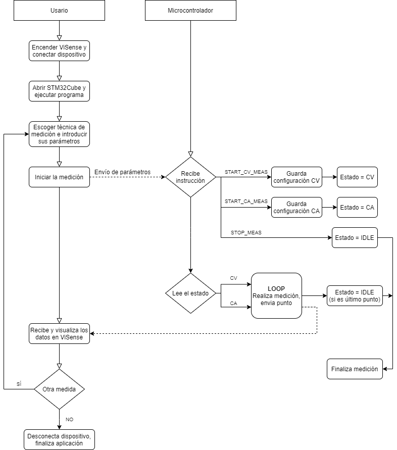
</a>

Los pasos que debe seguir el usuario para poder realizar los dos tipos de mediciones electroquímicas con el potenciostato son los siguientes:
Primero tiene que abrir el programa ViSense y conectar el dispositivo en el puerto del ordenador correspondiente.
Una vez hecho esto, tiene que ejecutar el programa de STM32Cube para poder medir con el potenciostato.
Ahora puede escoger el tipo de medición deseada (voltametría o cronoamperometría), configurar los distintos parámetros deseados, e iniciar la medición.
Una vez se inicia la medición, se envía una señal al microcontrolador, que recibe la instrucción correspondiente al tipo de medición escogida, realiza la medición y envía los distintos puntos en el tiempo hasta que acabe o el usuario lo pare. Al finalizar, el usuario puede escoger realizar otra medición, o simplemente desconectar el dispositivo y parar los programas.

Los diagramas de flujo correspondientes a la voltametría cíclica y a la cronoamperometría se pueden ver a continuación.

<a href="Docs/assets/Volta.png">
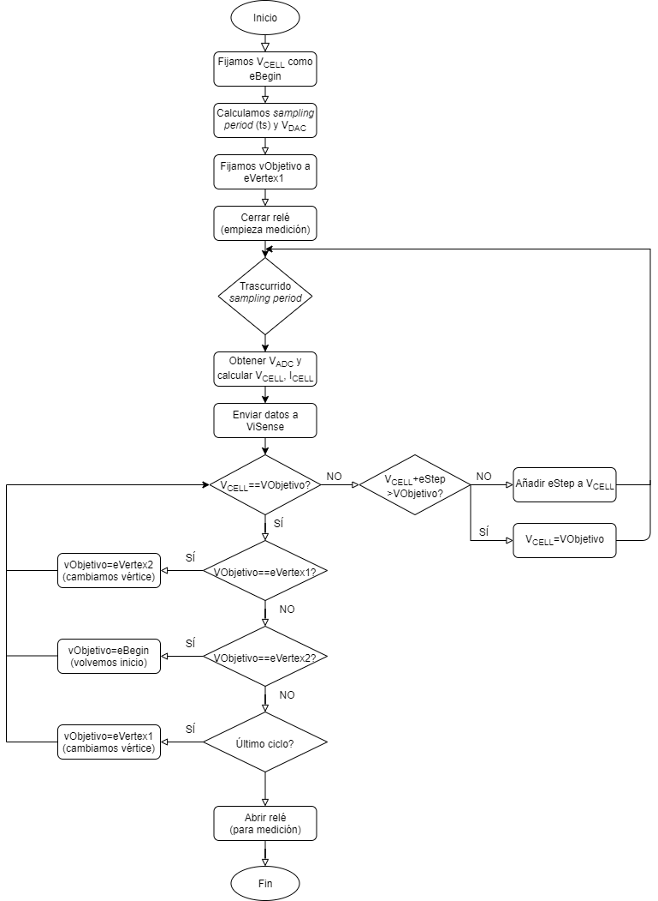
</a>

En la voltametría se realiza un barrido en tensión sobre la celda electroquímica. Para ello, se empieza desde `eBegin` y se va incrementando el valor en tensión en `eStep` hasta llegar a `eVertex1`. Una vez llegamos al primer vértice, cambiamos el objetivo para llegar al segundo vértice, también aplicando una diferencia de `eStep` en cada medición. Cuando ya hemos llegado al segundo vértice, volvemos a `eBegin`, completando un ciclo de la voltametría (y si tiene más ciclos, se repite el proceso).

<a href="Docs/assets/Crono.png">
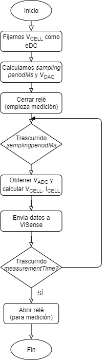
</a>

En la cronoamperometría se fija una tensión constante en la celda electroquímica durante un tiempo determinado, y se observan los resultados correspondientes.

## Resultados

Los resultados finales obtenidos se pueden ver a continuación.

### **Resultados voltametría cíclica**

En la primera imagen correspondiente a la voltametría cíclica, podemos ver la medición realizada con el potenciómetro para los parámetros especificados a la izquierda de la imagen.

<a href="Docs/assets/ResultadoVolta1.png">
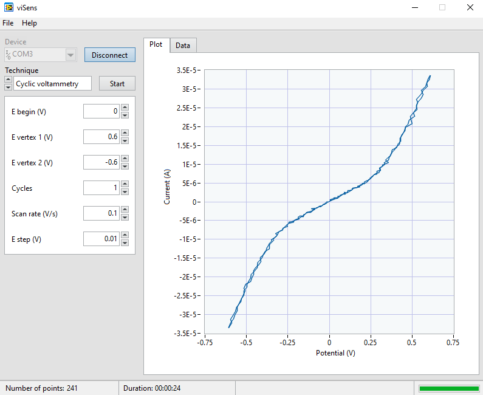
</a>

En las siguientes imágenes de la voltametría, podemos ver la misma medición pero en el gráfico correspondiente al potencial respecto al tiempo transcurrido (se puede ver claramente el barrido desde `eBegin` hasta cada vértice), y también de la corriente respecto al tiempo.

<a href="Docs/assets/ResultadoVolta2.png">
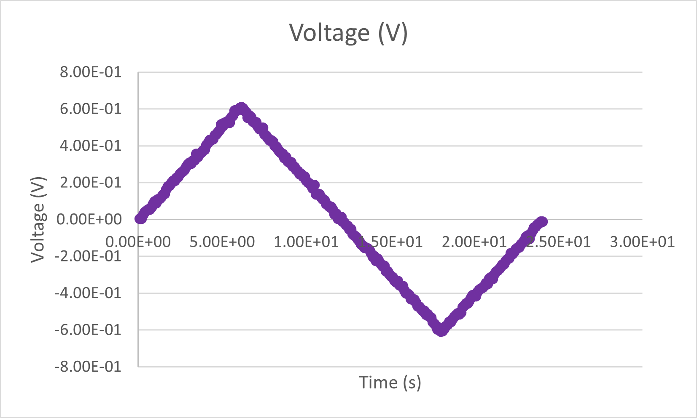
</a>

<a href="Docs/assets/ResultadoVolta3.png">
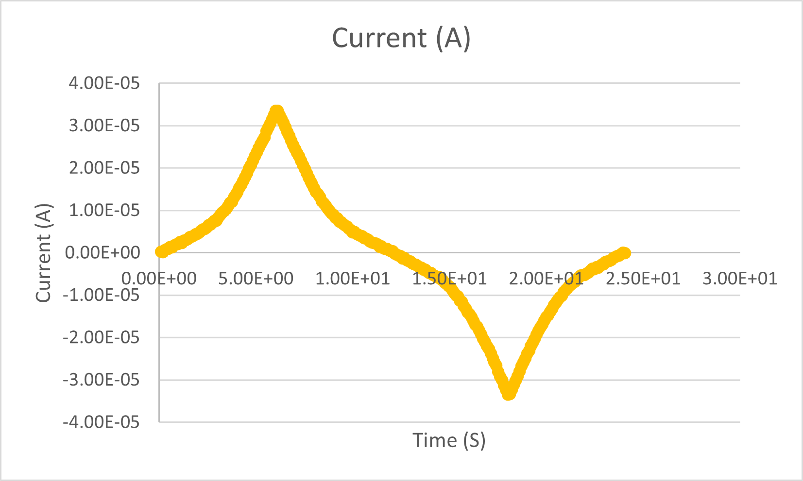
</a>

Una vez realizadas las pruebas sin la muestra y visto el correcto funcionamiento del programa, se procedió a realizar las medidas electroquímicas con una muestra de ferricianuro de potasio a diferentes concentraciones (1 mM y 5 mM). A continuación pueden verse los respectivos gráficos resultantes de la medición (primero el de 1mM, y después el de 5 mM).

<a href="Docs/assets/ResultadosVolta1mM.png">
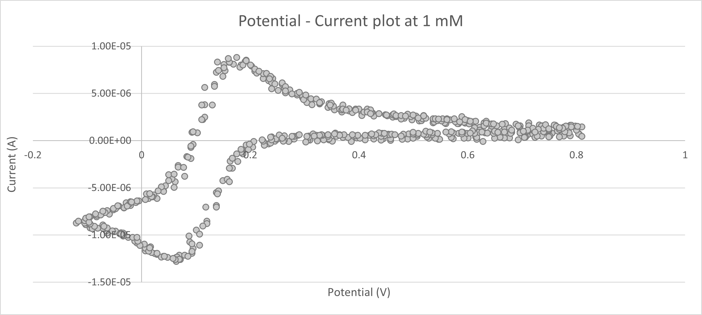
</a>

<a href="Docs/assets/ResultadosVolta5mM.png">
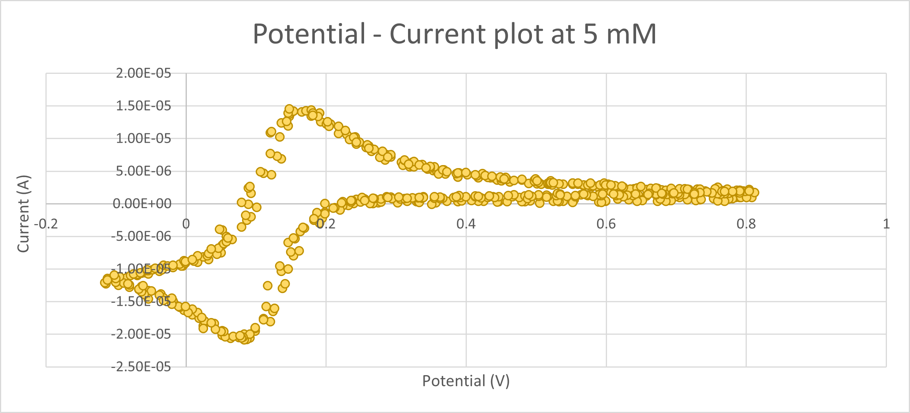
</a>

### **Resultados cronoamperometría**

En la siguiente imagen, podemos ver una cronoamperometría realizada con el potenciómetro con la configuración que se especifica a la izquierda de la imagen.

<a href="Docs/assets/ResultadoCrono1.png">
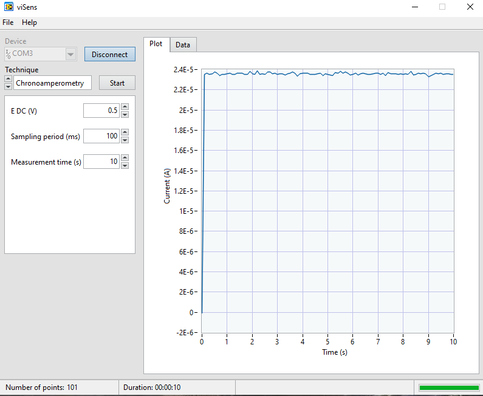
</a>

A parte del gráfico con el potencial respecto a la corriente, también se han realizado los gráficos con el potencial y la corriente respecto al tiempo (se puede ver como el primer punto inicial está a 0, y luego se queda un valor fijo en la celda), que se pueden ver a continuación.

<a href="Docs/assets/ResultadoCrono2.png">
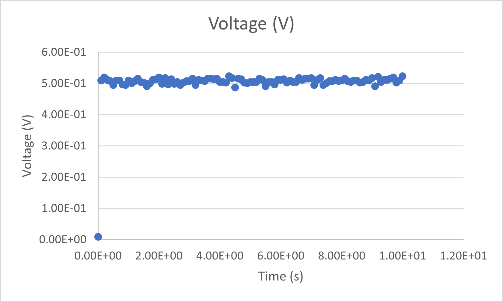
</a>

<a href="Docs/assets/ResultadoCrono3.png">
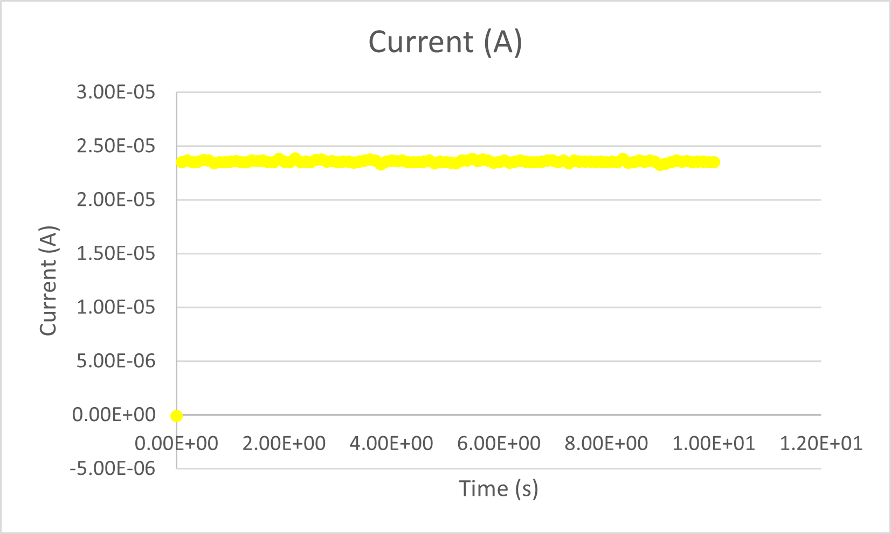
</a>

A continuación pueden verse los respectivos gráficos resultantes de la medición de una muestra de ferricianuro de potasio a diferentes concentraciones (primero el de 1mM, y después el de 5 mM).

<a href="Docs/assets/ResultadoCrono1mM.png">
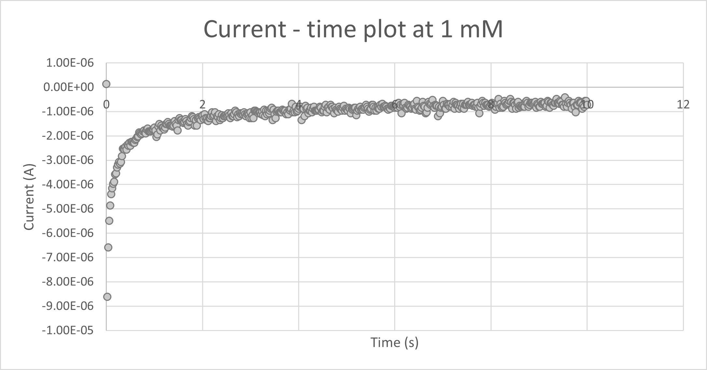
</a>

<a href="Docs/assets/ResultadoCrono5mM.png">
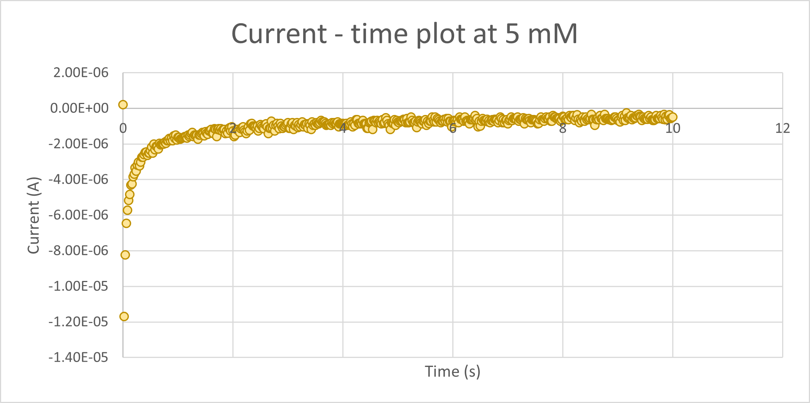
</a>

## **Conclusiones**

En líneas generales, en este proyecto se ha podido programar un potenciostato de manera satisfactoria. Hemos obtenido unos gráficos que coinciden con la morfología prevista para estas 2 técnicas bioquímicas caracterizando el proceso de oxidación del ferrocianuro de potasio a unas concentraciones de 1 y 5 mM. 
Por otro lado, con la finalización de MASB estamos muy satisfechos con el aprendizaje y la progresión que hemos alcanzado durante la asignatura, tanto en la introducción de nuevos conceptos importantes para trabajar con un microcontrolador como para la implementación de la comunicación entre diferentes dispositivos.
La forma en que se ha planteado nos ha permitido una introducción al flujo de trabajo en Git de una manera más individualizada y sobretodo para la coordinación de los integrantes del grupo para trabajar desde casa, que debido a la situación en la que nos encontramos cada vez tiene mayor importancia.
Por todo ello, consideramos que MASB nos ha servido como el umbral de la puerta hacia nuevos proyectos donde se necesiten dotes de programación en un entorno profesional.
